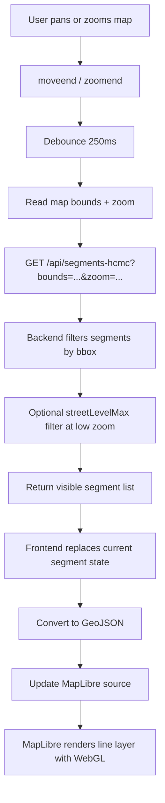

# Traffic Map PoC - Viewport Rendering Solution

## Summary

`traffic-map-poc` was refactored from a DOM-marker-heavy map into a viewport-driven MapLibre layer architecture.

The new solution is designed for road-segment traffic visualization, not point-of-interest maps.

The core decisions are:

- Fetch only the segments inside the current viewport
- Render segments with `GeoJSON source + line layer`
- Replace visible data on each viewport fetch instead of accumulating old data
- Reuse a single popup for hover details
- Reduce density at lower zoom levels by filtering road classes, not clustering segment midpoints

This gives the app a much more scalable base while keeping the implementation simple enough for a PoC.

---

## Problem

The previous implementation had the right intention, but the rendering path was still expensive:

- Each segment was rendered as its own `maplibregl.Marker`
- Each marker created its own DOM subtree
- Each marker attached its own hover behavior
- Tooltip behavior was tied to marker instances
- Frontend state accumulated previously fetched segments across pans

That combination creates two practical issues:

1. Browser rendering cost grows quickly when the visible segment count rises
2. Viewport loading loses much of its benefit if old viewport data stays mounted forever

This is especially problematic for the HCMC dataset because the raw data is already large enough to expose the weakness of DOM-based overlays.

---

## Why This Solution

This app visualizes **traffic road segments**, not discrete points.

Because of that, the right scaling strategy is:

- `line layer` for drawing
- viewport filtering for data transfer
- zoom-based road simplification for density control

The wrong strategy for this dataset would be:

- rendering HTML markers for each segment
- clustering segment midpoints as if they were POIs

Cluster is useful for point datasets. For traffic segments, it hides the actual road geometry and breaks the meaning of the data.

---

## Architecture

### Frontend

- `src/app/page.tsx`
  - listens to `moveend` and `zoomend`
  - debounces viewport fetches
  - requests the currently visible bounds
- `src/lib/useTrafficSegments.ts`
  - builds viewport queries
  - fetches visible segments from the API
  - replaces current segment state with the latest viewport response
  - applies low-zoom road filtering via query params
- `src/components/TrafficOverlay/TrafficOverlay.tsx`
  - converts visible segments to GeoJSON
  - renders them through a single MapLibre `line` layer
  - uses one popup instance for hover details

### Backend

- `src/app/api/segments-hcmc/route.ts`
  - reads cached CSV-backed segment data
  - filters by bounding box
  - optionally filters by `streetLevelMax`
  - returns only the visible road segments for the current viewport

---

## Request Flow



---

## Zoom Behavior

The app now uses zoom-driven density control instead of trying to show every segment all the time.

### Rules

- `zoom < 12`
  - show only major roads
  - API uses `streetLevelMax=1`
- `12 <= zoom < 14`
  - show more roads
  - API uses `streetLevelMax=2`
- `zoom >= 14`
  - show full viewport detail
- `zoom >= 15`
  - enable hover detail popup

This keeps the city-level view readable and reduces visual overload without losing the correct road geometry.

---

## Rendering Strategy

### Old

- one segment -> one HTML marker
- one marker -> one DOM tree
- hover handled per marker

### New

- one viewport -> one GeoJSON collection
- one collection -> one MapLibre source
- one source -> one WebGL line layer
- one popup reused for hover

This is the biggest performance win in the refactor.

---

## API Contract

### Request

```http
GET /api/segments-hcmc?bounds=minLat,minLng,maxLat,maxLng&zoom=14.2&streetLevelMax=2
```

### Response

```json
{
  "segments": [
    {
      "segment_id": 123,
      "s_lat": 10.78,
      "s_lng": 106.69,
      "e_lat": 10.781,
      "e_lng": 106.691,
      "street_name": "Vo Van Kiet",
      "street_level": 1,
      "max_velocity": 60,
      "length": 124.4
    }
  ],
  "total": 1,
  "zoom": "14.2"
}
```

### Notes

- `bounds` is the required input for viewport filtering
- `streetLevelMax` is used as a practical low-zoom simplification control
- response returns only currently visible segments, not global dataset pages

---

## Hover Design

Hover detail is intentionally limited:

- only one popup exists
- popup content is updated from `queryRenderedFeatures`
- hover is enabled only at higher zoom

This avoids the common trap of spawning hundreds or thousands of popup-capable objects.

---

## Key Tradeoffs

### What we gained

- Much lower DOM cost
- Cleaner separation between viewport fetch and rendering
- Better fit for large segment datasets
- More readable low-zoom map behavior
- Simpler future path toward tiles or server-side aggregation

### What we intentionally did not do

- No clustering, because the dataset is segment-based
- No vector tiles yet, because the PoC does not need that complexity yet
- No backend aggregation layer yet, because bbox filtering plus road-class simplification is enough for current scope

---

## Current File Changes

- `traffic-map-poc/src/app/page.tsx`
  - viewport fetch trigger and updated UI messaging
- `traffic-map-poc/src/lib/useTrafficSegments.ts`
  - replace-on-fetch viewport state model
- `traffic-map-poc/src/components/TrafficOverlay/TrafficOverlay.tsx`
  - MapLibre line layer rendering and single-popup hover
- `traffic-map-poc/src/app/api/segments-hcmc/route.ts`
  - bbox and `streetLevelMax` filtering
- `traffic-map-poc/src/lib/useTrafficPredictionCache.ts`
  - cache type alignment after refactor

---

## Verification

The refactor was verified with:

- `npm run lint`
- `npm run build`

Build passed successfully.

Existing warnings remain in unrelated areas:

- `src/app/layout.tsx`
- `src/components/Map/MapView.tsx`

These warnings were pre-existing and are not blockers for this solution.

---

## Recommended Next Steps

### Short term

- Return GeoJSON directly from the API to remove frontend conversion
- Add lightweight viewport caching on the client
- Tune low-zoom thresholds based on actual usage

### Medium term

- Add server-side spatial indexing
- Add route-specific highlighting on top of the line layer
- Move LOS prediction closer to API response generation

### Long term

- Move to vector tiles or tiled segment delivery if the dataset grows substantially
- Add server-side aggregation for city-wide overview modes

---

## Decision Statement

For `traffic-map-poc`, the most appropriate scalable architecture is:

**viewport-based segment fetching + MapLibre line-layer rendering + single-popup hover + zoom-based road simplification**

That is the correct fit for a traffic road network PoC and a stronger foundation than DOM markers or point-style clustering.
